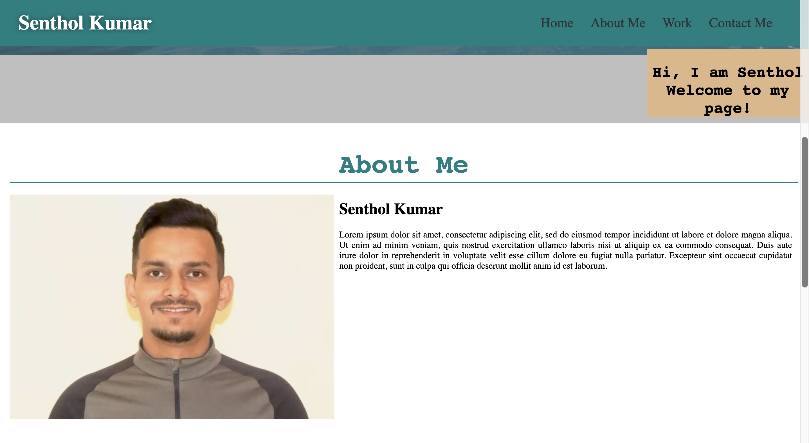
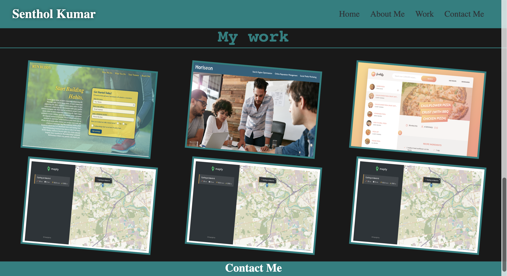

# MY PORTFOLIO

# PURPOSE

Create a portfolio website introducing myself and my work. Along with my contact information for future opportunities.

# PREVIEW

# TECHNOLOGIES USED

HTML
CSS

# SITE WILL BE UPDATED WITH:

JS
QUERY
and Other technologies

# WEBSITE URL

https://katochsenthal.github.io/my-portfolio/

# INSTALLATION

You may open the website on the browser of your choice.

# CREDITS

Senthol Kumar

# UPDATES

File last update on Mar 5, will be updating on regular basis.
File last update on Mar 16, will be updating on regular basis.
